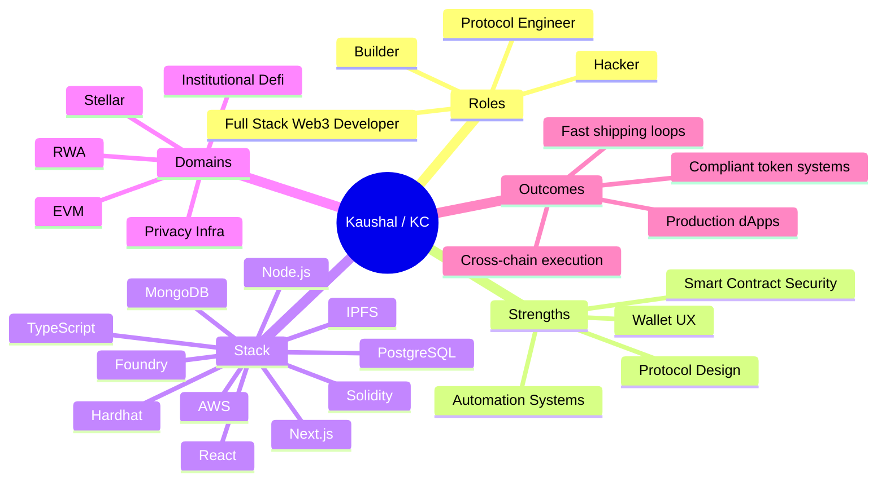

<h1 align="center">Kaushal (KC) - Yo Engineer ⚡</h1>

  Full Stack Web3 Developer • Protocol Engineer • Product Builder • Hackathon Hacker

  I build real on-chain products - not demos.  
  From wallet-first UX to protocol-grade smart contracts and backend automation.

---

## `whoami`

I’m **Kaushal (KC)**, a developer-engineer hybrid focused on the intersection of:

- **Product-quality dApps**
- **Protocol-level blockchain design**
- **Secure smart contract systems**
- **Execution speed under real constraints**

I love solving hard problems across the full stack: frontend polish, smart contract correctness, infra reliability, and shipping velocity.

---

## Core Identity (my engineering essence)

- **Builder mindset:** Ship fast, iterate faster, keep users at the center.
- **Protocol thinking:** Design systems with trust, compliance, and composability in mind.
- **Hacker approach:** Break assumptions early, stress test architecture, then harden.
- **Full-stack ownership:** Frontend, backend, contracts, infra — end to end.

---

## Tech I Trust

**Frontend:** React, Next.js, TypeScript, Tailwind, Vite  
**Web3:** Solidity, Ethers.js, Wagmi, WalletConnect, Hardhat, Foundry, OpenZeppelin  
**Backend & Infra:** Node.js, NestJS, Express, Prisma, PostgreSQL, MongoDB, AWS, IPFS  
**Specialized:** DID/VC, ERC-3643, Cross-chain execution, ZK-enabled workflows (Groth16, Merkle commitments)

---

## Impact Snapshot

### PayZoll (ex-PayNova) — Blockchain Developer & Researcher
- Led production frontend with wallet connectivity and responsive UX.
- Built payroll smart contracts for automated salary disbursement.
- Integrated DID + Verifiable Credentials for privacy-centric identity.
- Used Stellar rails for low-cost cross-border payment operations.

### TheOpenAssets (ex-Credora) — Protocol & Smart Contract Engineer
- Implemented **ERC-3643 (T-REX)** for compliant RWA issuance.
- Built modular execution for Mantle, OneChain, Creditcoin, Stellar.
- Engineered backend automation for liquidation + yield monitoring.

---

## Projects I’m Proud Of

### Meridian Finance — Privacy-Preserving Bond Protocol
Production dApp with secure wallet auth and privacy-first bond lifecycle.  
**Stack:** Stellar Soroban, ZK, Next.js, Node.js, MongoDB

### Zera — AI-Powered Smart Contract Platform
Winner project that generates contracts, docs, and tests from prompts.  
**Stack:** Solidity, React, Hardhat, IPFS, Vite

---

## Wins

- 🏆 Winner — BNB Chain Hackathon Q4 (2024)
- 🥇 5x Hackathon Winner across multiple ecosystems
- 🌟 BNB Chain Martian (2025)

---

## Architecture of Me (Mermaid)

---

## 🤝 Let’s Connect

- 📧 **Email:** [chaudharikaushal02@gmail.com](mailto:chaudharikaushal02@gmail.com)
- 💼 **LinkedIn:** [kaushal-chaudhari-21b83a1b0](https://linkedin.com/in/kaushal-chaudhari-21b83a1b0)
- 🐙 **GitHub:** [kaushalya4s5s7](https://github.com/kaushalya4s5s7)

---

  <i>“Build boldly. Break assumptions. Ship decentralized.”</i>

  

    CS @ IIIT, Guwahati | Web3 Developer & Hacker ⚡
     
    Building (and breaking) banger products for the decentralized web.
  

